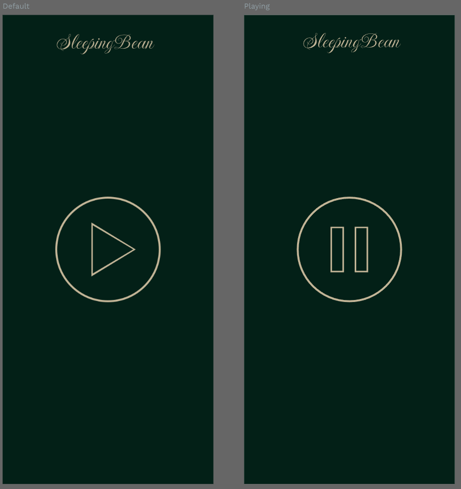

# SleepingBean

I hate ads and the sleep app that I am using is crashing at 2am waking me up...

SleepingBean is a simple mobile app for Android phones (installed through Obtainium). It features a
single 10s track of pink noise that repeats indefinitely.



## Development
### Approach

This project uses the default OpenSpec workflow.


### Environment Workflow
```
# Start coding agent VM in a full-screen tmux pane
$ sca start oc

# Start Expo Server in a different tmux pane
$ task expo-start

# Stop Expo Server
$ task expo-stop
```

Once the Expo Server has been started, the Expo Go mobile app can be pointed at
`exp://fw-amd7-ai:8081`

### Tests

```
$ npm test          # jest, preset: jest-expo
```

The playback logic lives in `src/hooks/useSleepAudio.ts` and is covered by
`src/__tests__/useSleepAudio.test.ts` (background mode setup, safe player calls,
recovery after the system pauses us, loop/resume semantics). `expo-audio` is
mocked once for the whole suite in `__mocks__/expo-audio.ts`; the tests script
native failures and fire `playbackStatusUpdate` events with the `audioMock`
helper re-exported from `src/__tests__/audio-mock.ts`.

## Overnight crash diagnosis

The app plays through `expo-audio`, which runs a media-playback foreground
service (`expo.modules.audio.service.AudioControlsService`,
`foregroundServiceType="mediaPlayback"`, plus the `FOREGROUND_SERVICE` and
`FOREGROUND_SERVICE_MEDIA_PLAYBACK` permissions). Those entries are injected by
the `expo-audio` config plugin declared in `app.json`; confirm them after a
native-project generation:

```
$ npx expo prebuild --platform android
$ grep -nE 'FOREGROUND_SERVICE|mediaPlayback' android/app/src/main/AndroidManifest.xml
```

Nothing else is needed on the manifest side — an overnight kill that survives a
correct foreground service is a Doze/battery or native-process problem, so
capture evidence before changing code.

### Let the app run overnight (GrapheneOS)

1. `Settings` → `Apps` → `See all apps` → `OpenSleepSounds` → `Battery` →
   `Unrestricted` (i.e. turn battery optimisation off for the app). Do the same
   under `Settings` → `Battery` → `Battery usage` if the per-app entry is hidden.
2. Whitelist it from Doze from the host machine (package id
   `com.workspace`, from `app.json`):

```
$ adb deviceidle whitelist +com.workspace
```

### Capture logs

```
# enlarge the ring buffer first, otherwise the overnight window rolls away
$ adb logcat -G 16M
$ adb logcat -c
$ adb logcat -v threadtime > sleep.log     # keep running overnight
```

If the phone is not reachable over adb overnight, pull a full report the morning
of the crash instead:

```
$ adb bugreport bugreport.zip
```

### Grep the capture

```
$ grep -nE 'hardened_malloc|F DEBUG|IllegalStateException|AudioFocus' sleep.log
$ grep -nE 'com\.workspace|AudioControlsService|sleep-audio' sleep.log
```

| Pattern | What it means |
| --- | --- |
| `hardened_malloc` | GrapheneOS allocator caught memory corruption / overflow in the app process |
| `F DEBUG` | native (signal) crash dump written by debuggerd — check the backtrace and the faulting library |
| `IllegalStateException` | framework rejected a media/player call (e.g. a released or dead player, dead media session) |
| `AudioFocus` | another app (alarm, call, video) took audio focus away from us |
| `[sleep-audio]` | our own recovery/failure logging (`src/hooks/safeCall.ts`) |

A `F DEBUG` / `hardened_malloc` line pointing inside a native audio library is
evidence of a native fault rather than a JavaScript problem: keep the whole
surrounding block (and `sleep.log`) for a follow-up report.

### Findings

Record each run here with the date, device/OS build, and outcome.

| Date | Device | Result |
| --- | --- | --- |
| _pending_ | GrapheneOS device (see change `fix-overnight-audio-crash`, task 5.2) | awaiting an overnight (~6 h) run with playback started, screen locked, a focus steal triggered, battery exemption applied and `sleep.log` captured |
