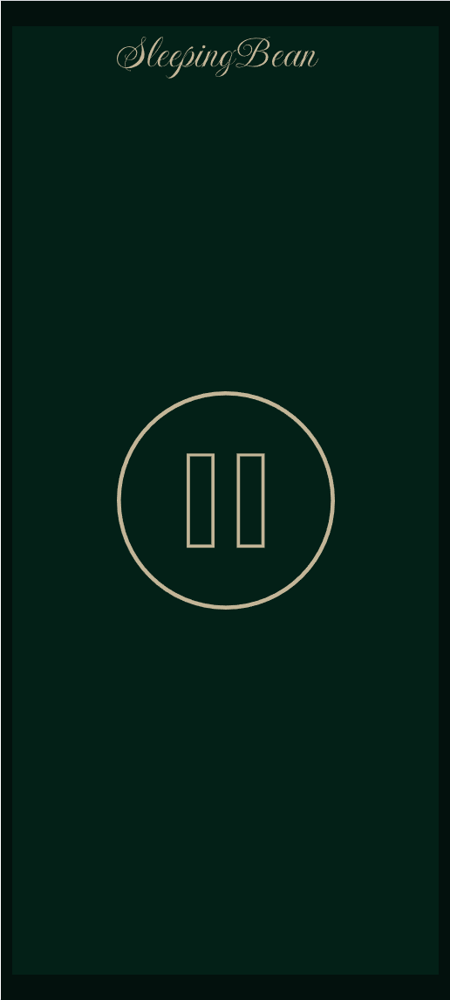

# SleepingBean

I hate ads and the sleep app that I am using is crashing at 2am waking me up...

SleepingBean is a simple mobile app for Android phones (installed through Obtainium). It features a
single 10s track of pink noise that repeats indefinitely.




## Development
### Approach

This project uses the default OpenSpec workflow.


### Environment Workflow
```
# Start coding agent VM in a full-screen tmux pane
$ sca start oc

# Start Expo Server in a different tmux pane
$ task expo-start

# Stop Expo Server
$ task expo-stop
```

Once the Expo Server has been started, the Expo Go mobile app can be pointed at
`exp://fw-amd7-ai:8081`
